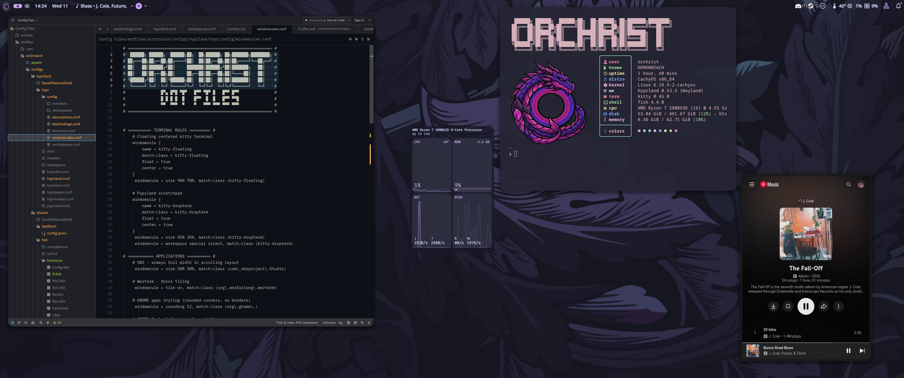

# Orchriarch Dotfiles
 
**Orchrist's Arch Configurations** for Hyprland with DankMaterialShell

A complete, ready-to-use desktop environment configuration for Arch Linux featuring modern Wayland compositors with Catppuccin Design aesthetics.

Most of this code was yoinked from TheBlackDon on youtube. If you enjoy this rendition of his config files, consider supporting him on Ko-fi! Every little bit means the world! https://ko-fi.com/theblackdon


## Features

- **DankMaterialShell (DMS)**: Beautiful Material Design shell with bar, notifications, launcher, and lock screen
- **Catppuccin Mocha Theme**: Consistent theming across all applications (GTK, Qt, terminal, shell)
- **DMS-Greeter**: Elegant display manager for seamless session switching
- **Curated Applications**: kitty terminal, fish shell, nemo file manager, and optional apps
- **Symlinked Configs**: Easy to update - edit files in the repo and changes apply immediately

## Screenshots


*OrchriArch running with Hyprland, DankMaterialShell, and Catppuccin Mocha Mauve theme*

## Requirements

- **OS**: Arch Linux or Arch-based distribution (CachyOS, EndeavourOS, etc.)
- **AUR Helper**: paru or yay
- **Internet Connection**: Required for package installation

## Installation

### Quick Install

```bash
sudo pacman -S yay
git clone https://github.com/orchrist-pc/orchriarch.git
cd orchriarch
./install.sh ( you may need to run chmod +x install.sh first )
```

The installer will guide you through:
1. System compatibility checks
2. Compositor selection (Hyprland)
3. Optional application selection
5. Package installation
6. Configuration deployment
7. Theme application
8. Display manager setup

### What Gets Installed

**Core Packages:**
- Build tools (git, cmake, meson, gcc, base-devel)
- jq and dialog for the installer

**Compositor Packages:**
- Hyprland: hyprland, hypridle, xdg-desktop-portals, screenshot tools, pyprland

**Theme Packages:**
- Catppuccin GTK theme (Mocha variant)
- Tela purple icon theme
- Bibata Modern Ice cursor theme
- Qt5/Qt6 Wayland support and theming
- Kvantum theme engine

**DMS & Display Manager:**
- DankMaterialShell (dms-shell-git)
- Quickshell (DMS dependency)
- greetd + greetd-dms-greeter-git

**Auto-Installed Applications:**
- kitty (terminal)
- fish (shell)
- nemo (file manager)
- Loupe (image viewer application)
- VLC (video player)
- fastfetch (system info)
- Zen Browser (privacy-focused browser)
- satty (screenshot photo editor utility)
- nvidia-container-toolkit (allows use of nvidia gpu from docker containers)

**Optional Applications:**
- Zed (modern code editor)
- Helix (modal text editor)
- Obsidian (notes vault)
- Discord
- Macro tools (wtype + xdotool)
- docker + docker-compose
- flatpak (install flatpak applications)

## Post-Installation

### First Login

1. **Reboot your system**
2. **At the DMS-greeter login screen:**
   - Select your preferred session (Hyprland or Niri)
   - Log in with your credentials
3. **Enjoy your beautiful desktop!**

### Key Bindings

#### Basic Keybinds
- `Super + A` - Application launcher
- `CTRL + F11` - Terminal (kitty)
- `Super + Shift + T` - Floating Terminal (kitty)
- `Super + Q` - Close window
- `CTRL + F10` - File manager (nemo)
- `Super + Shift + B` - Browser
- `Super + Scroll Up or Down` - Move relative workspaces
- `Super + Shift + Scroll Up or Down` - Move your window to relative workspaces
- `Super + (1,2,3,4,5,6,7,8)` - Open a specific workspace
- `Super + Shift + (1,2,3,4,5,6,7,8)` - Move your window to a specific workspace

#### Media Keybinds
- `Super + Shift + O` - Volume up
- `Super + Shift + L` - Volume down
- `Super + Shift + I` - Toggle mute

#### System Keybinds
- `Super + CTRL + P` - Logout
- `Super + L` - Lock computer
- `Super + Shift + H` - Reload Hyprlan
- `Super + Shift + Y` - Reload Quickshell/DMS (top bar)

It is highly recommended to lookthrough the kebinds.conf configuration file for a full list of keybinds.

```

## Customization

All configuration files are symlinked from the repository, making customization easy:

```bash
cd orchriarch

# Edit compositor configs
nano configs/hyprland/hypr/hyprland.conf

# Edit terminal config
nano configs/shared/kitty/kitty.conf

# Edit shell config
nano configs/shared/fish/config.fish

# Edit DMS settings
nano configs/shared/DankMaterialShell/settings.json
```

Changes take effect immediately (or after reloading the compositor with `Super+Shift+H`).

### Changing Wallpapers

Replace the wallpaper at:
```bash
assets/wallpapers/wallpaper.png
```

Or edit the compositor config to point to your own wallpaper.

## Troubleshooting

### DMS-greeter doesn't start
```bash
# Check greetd status
sudo systemctl status greetd

# Check greetd config
cat /etc/greetd/config.toml

# Restart greetd
sudo systemctl restart greetd
```

### Themes not applying
```bash
# Reapply themes manually
gsettings set org.gnome.desktop.interface gtk-theme 'catppuccin-mocha-mauve-standard+default'
gsettings set org.gnome.desktop.interface icon-theme 'Tela-purple-dark'
gsettings set org.gnome.desktop.interface cursor-theme 'Bibata-Modern-Ice'
```

### DMS shell not starting
```bash
# Check if DMS is running
pgrep -a dms

# Start DMS manually
dms run
```

### Compositor won't start
```bash
# For Hyprland
Start-Hyprland

# Check logs
journalctl --user -xe
```

## Uninstallation

To remove orchriarch and restore your system:

```bash
# Stop and disable greetd
sudo systemctl disable --now greetd

# Restore original configs (if you made a backup)
rm -rf ~/.config
mv ~/.config.backup-YYYYMMDD_HHMMSS ~/.config

# Remove symlinks
unlink ~/.config/hypr
unlink ~/.config/DankMaterialShell
# ... etc

# Optionally remove packages
sudo pacman -R hyprland dms-shell-git greetd-dms-greeter-git
```

## Directory Structure

```
orchriarch/
├── install.sh              # Main installer script
├── README.md               # This file
├── lib/                    # Installer library functions
│   ├── utils.sh           # Utility functions
│   ├── checks.sh          # System checks
│   ├── packages.sh        # Package installation
│   ├── dotfiles.sh        # Config deployment
│   ├── themes.sh          # Theme application
│   └── greeter.sh         # Display manager setup
├── configs/               # Configuration files
│   ├── shared/            # Shared between compositors
│   ├── hyprland/          # Hyprland-specific
├── packages/              # Package lists
└── assets/                # Wallpapers and images
```

## Credits

- **[DankMaterialShell (DMS)](https://github.com/dburian/DankMaterialShell)** - Beautiful Material Design shell for Wayland
- **[Hyprland](https://hyprland.org/)** - Dynamic tiling Wayland compositor
- **[Catppuccin](https://github.com/catppuccin/catppuccin)** - Soothing pastel theme
- **[greetd](https://git.sr.ht/~kennylevinsen/greetd)** - Minimal display manager

## License

MIT License - Feel free to use and modify as you wish!

---

**Made with ❤️ by TheBlackDon, yoinked, personalized, and probably butchered by Orchrist**
